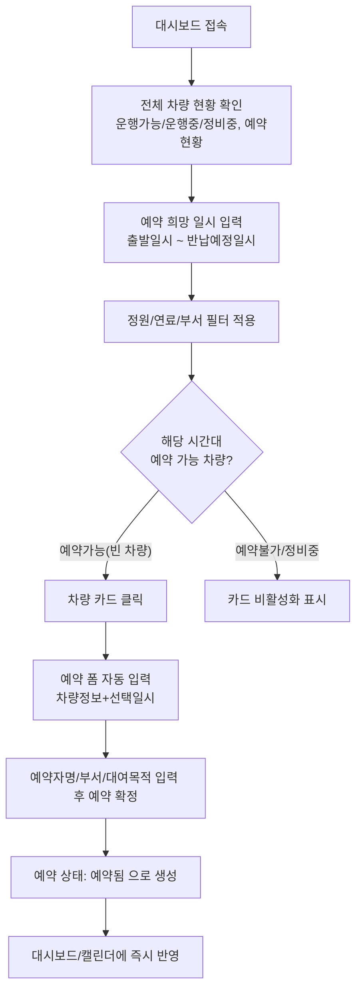
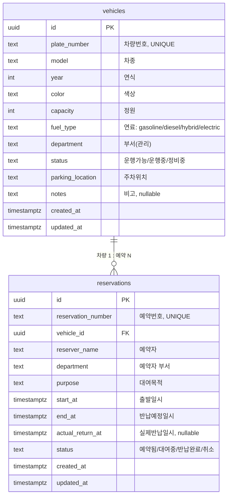

# hyedrive 기획서 (PRD)

## 1. 개요

| 항목 | 내용 |
|---|---|
| 서비스명 | hyedrive |
| 한 줄 정의 | 사내 업무용 차량의 운행현황·예약현황을 한눈에 보고, 빈 차량을 클릭해 바로 예약하는 사내 차량 예약 웹서비스 |
| 대상 사용자 | 사내 임직원(예약자), 차량 관리 담당자(총무팀 등 관리자) |
| 데이터베이스 | Supabase (PostgreSQL) |
| 참고 데이터 | `carlist.xlsx` (차량 목록 시트 21대, 예약 현황 시트 30건) |

### 배경 및 문제 정의
현재 차량 운행/예약 현황이 엑셀 파일로 관리되어 실시간 현황 파악이 어렵고, 예약 시 다른 사람과 일정이 겹치는지 수기로 확인해야 한다. hyedrive는 이 과정을 웹에서 실시간으로 확인하고, 조건에 맞는 빈 차량을 즉시 예약할 수 있도록 한다.

### 목표
- 차량별 운행현황(운행가능/운행중/정비중)과 예약현황을 실시간 대시보드로 제공
- 원하는 이용 일시를 기준으로 **정원 / 연료 / 부서(관리) / 상태** 조건을 확인하여 예약 가능한 차량만 필터링
- 빈 차량 카드를 클릭하면 바로 예약 폼으로 연결되는 원클릭 예약 플로우 제공

### Out of Scope (1차 범위 제외)
- 결제/비용 정산 기능
- 유류비·주행거리 등 차량 운행일지 상세 관리
- 사내 인증 시스템(SSO) 연동 — 1차는 이름/부서 입력 또는 Supabase Auth 이메일 로그인 중 단순한 방식으로 시작

---

## 2. 참고 데이터 분석 (carlist.xlsx)

### 시트1: 차량 목록 (21대)
| 컬럼 | 예시 값 | 비고 |
|---|---|---|
| 차량번호 | `12가 3456` | 고유 식별자(PK 후보) |
| 차종 | 아반떼, 쏘나타, 그랜저, 카니발, K5, EV6 등 | |
| 연식 | 2019 ~ 2023 | |
| 색상 | 흰색, 검정색, 은색 등 | |
| 정원 | 3 / 4 / 5 / 7 / 9 / 11 / 12 | 인승 수, 필터 조건 |
| 연료 | 가솔린 / 디젤 / 하이브리드 / 전기 | 필터 조건 |
| 부서(관리) | 총무팀 / 개발팀 / 마케팅팀 / 인사팀 / 경영지원팀 / 영업팀 | 관리 부서, 필터 조건 |
| 상태 | 운행가능 / 운행중 / 정비중 | 필터 조건, 예약 가능 여부 판단 |
| 주차위치 | 본관 지하1층 2번 등 | |
| 비고 | 겨울용 스노우체인 비치 등 (nullable) | |

### 시트2: 예약 현황 (30건)
| 컬럼 | 예시 값 | 비고 |
|---|---|---|
| 예약번호 | `R2026071` | 예약 고유 식별자 |
| 차량번호 | `78라 1234` | 차량 목록 FK |
| 예약자 | 김민준 등 | |
| 부서 | 예약자 소속 부서 (차량 관리 부서와 다를 수 있음) | |
| 대여목적 | 행사 지원, 거래처 미팅, 공항 픽업 등 | 자유 텍스트 |
| 출발일시 | `2026-07-09 12:00` | |
| 반납예정일시 | `2026-07-09 15:00` | |
| 실제반납일시 | 반납 완료 시에만 값 존재 | nullable |
| 상태 | 예약됨 / 대여중 / 반납완료 | 예약 생명주기 |

### 데이터에서 도출한 핵심 규칙
1. 차량 1대는 여러 건의 예약 이력을 가질 수 있다 (1:N).
2. 예약 상태는 `예약됨 → 대여중 → 반납완료`의 순서로 전이되며, 조기/지연 반납 시 `실제반납일시`가 `반납예정일시`와 달라질 수 있다.
3. 차량의 `상태`(운행가능/운행중/정비중)는 예약 현황과 연동되어야 한다 — 즉, 특정 시점 기준으로 "대여중" 예약이 있으면 그 차량은 해당 시간 동안 이용 불가로 표시되어야 한다.

---

## 3. 핵심 사용자 흐름 (User Flow)

### 흐름 설명
1. **대시보드**: 전체 차량을 카드/테이블 형태로 보여주고, 각 차량의 현재 상태와 오늘/이번 주 예약 일정을 함께 노출한다.
2. **조건 입력**: 사용자가 이용하려는 출발일시~반납예정일시를 지정하면, 그 시간대에 이미 예약(대여중/예약됨)이 겹치는 차량은 "예약불가"로 표시된다.
3. **필터링**: 정원(인승 수 이상), 연료, 관리 부서, 상태(정비중 차량 자동 제외)를 조건으로 좁힌다.
4. **원클릭 예약**: 필터를 통과한 "빈 차량" 카드를 클릭하면 해당 차량 정보와 선택한 일시가 미리 채워진 예약 폼이 열린다.
5. **예약 확정**: 예약자, 부서, 대여목적을 입력하고 확정하면 `reservations` 테이블에 `예약됨` 상태로 저장되고 대시보드/캘린더에 즉시 반영된다.

---

## 4. 기능 요구사항

### 4.1 차량 운행/예약 현황 대시보드
- 전체 차량을 카드 또는 리스트 뷰로 표시 (차량번호, 차종, 정원, 연료, 부서, 상태 뱃지 포함)
- 상태별 뱃지 색상 구분: 운행가능(초록) / 운행중(파랑) / 정비중(회색·비활성)
- 차량별 예약 일정을 캘린더(주/일 단위) 또는 타임라인 뷰로 확인
- 검색 및 필터: 부서, 연료, 정원(이상), 상태
- 실시간 갱신: Supabase Realtime 구독으로 예약 생성/변경 시 자동 반영

### 4.2 예약 가능 차량 조회 (조건 검색)
- 사용자가 출발일시 / 반납예정일시를 입력
- 아래 조건을 만족하는 차량만 "예약 가능(빈 차량)"으로 표시
  - 상태가 `정비중`이 아님
  - 선택한 정원 조건 충족 (예: 5인승 이상)
  - 선택한 연료 타입 일치 (전체/가솔린/디젤/하이브리드/전기)
  - 선택한 관리 부서 일치 (전체 또는 특정 부서)
  - 선택 시간대에 겹치는 `예약됨` 또는 `대여중` 상태의 예약 건이 없음 (시간 중복 검사)

### 4.3 원클릭 예약
- 예약 가능 차량 카드 클릭 → 예약 모달/페이지로 이동, 차량 정보와 선택 일시 자동 입력
- 필수 입력값: 예약자명, 부서, 대여목적, 출발일시, 반납예정일시
- 제출 시 서버(Supabase) 측에서 동일 차량·시간대 중복 예약 여부 재검증 후 저장 (동시성 대비)
- 예약 성공 시 `reservations.status = '예약됨'`으로 생성, 예약번호 자동 발급

### 4.4 예약 관리
- 예약자는 본인 예약 목록에서 예약 취소/수정 가능 (출발 전까지)
- 대여 시작 시각 도달 시 상태를 `대여중`으로 전환 (자동 배치 또는 수동 "대여 시작" 처리)
- 반납 시 실제반납일시 기록 후 상태를 `반납완료`로 전환, 차량 상태는 `운행가능`으로 복귀
- 관리자는 차량 상태를 수동으로 `정비중` ↔ `운행가능`으로 전환 가능 (예: 점검 등록)

### 4.5 관리자 기능 (차량 관리)
- 차량 등록/수정/삭제 (차량번호, 차종, 연식, 색상, 정원, 연료, 부서, 주차위치, 비고)
- 차량 상태 강제 변경 (정비 등록 등)
- 전체 예약 내역 조회 및 취소 처리

---

## 5. 데이터 모델 (Supabase / PostgreSQL)

### ERD 개요

### 5.1 `vehicles` 테이블

| 컬럼명 | 타입 | 제약조건 | 설명 |
|---|---|---|---|
| id | uuid | PK, default `gen_random_uuid()` | |
| plate_number | text | UNIQUE, NOT NULL | 차량번호 (예: `12가 3456`) |
| model | text | NOT NULL | 차종 |
| year | int | NOT NULL | 연식 |
| color | text | | 색상 |
| capacity | int | NOT NULL | 정원 |
| fuel_type | text | NOT NULL, CHECK IN ('가솔린','디젤','하이브리드','전기') | 연료 |
| department | text | NOT NULL | 관리 부서 |
| status | text | NOT NULL, DEFAULT '운행가능', CHECK IN ('운행가능','운행중','정비중') | 상태 |
| parking_location | text | | 주차위치 |
| notes | text | nullable | 비고 |
| created_at | timestamptz | DEFAULT now() | |
| updated_at | timestamptz | DEFAULT now() | |

### 5.2 `reservations` 테이블

| 컬럼명 | 타입 | 제약조건 | 설명 |
|---|---|---|---|
| id | uuid | PK, default `gen_random_uuid()` | |
| reservation_number | text | UNIQUE, NOT NULL | 예약번호 (예: `R2026071`), 시퀀스/트리거로 자동 생성 |
| vehicle_id | uuid | FK → vehicles.id, NOT NULL | |
| reserver_name | text | NOT NULL | 예약자 |
| department | text | NOT NULL | 예약자 부서 |
| purpose | text | NOT NULL | 대여목적 |
| start_at | timestamptz | NOT NULL | 출발일시 |
| end_at | timestamptz | NOT NULL, CHECK (end_at > start_at) | 반납예정일시 |
| actual_return_at | timestamptz | nullable | 실제반납일시 |
| status | text | NOT NULL, DEFAULT '예약됨', CHECK IN ('예약됨','대여중','반납완료','취소') | |
| created_at | timestamptz | DEFAULT now() | |
| updated_at | timestamptz | DEFAULT now() | |

### 5.3 핵심 제약/로직
- **중복 예약 방지**: `vehicle_id` + 시간 구간(`start_at`~`end_at`)이 겹치는 `예약됨`/`대여중` 건이 존재하면 신규 예약 불가. PostgreSQL `EXCLUDE` 제약(예: `btree_gist` + `tsrange`) 또는 API 레이어에서의 트랜잭션 검증으로 구현.
- **차량 상태 자동 갱신(권장)**: 예약 상태 변경 시 트리거로 `vehicles.status`를 동기화
  - 예약이 `대여중`으로 전환 → 해당 차량 `status = '운행중'`
  - 예약이 `반납완료`/`취소`로 전환 → 다른 활성 예약이 없으면 차량 `status = '운행가능'` (단, 관리자가 `정비중`으로 지정한 경우는 유지)
- **RLS(Row Level Security)**: Supabase 사용 시 `vehicles`는 전체 조회 가능(읽기), `reservations`는 예약자 본인 또는 관리자만 수정 가능하도록 정책 설정 (1차 버전은 이름 기반 단순 구분, 추후 Supabase Auth 연동 시 `user_id` 컬럼 추가하여 강화)

---

## 6. 화면 구성 (Wireframe 레벨)

### 6.1 메인 대시보드
- 상단: 서비스 로고(hyedrive), 검색/필터 바 (부서 · 연료 · 정원 · 상태 · 이용 일시)
- 본문: 차량 카드 그리드
  - 카드 구성: 차량번호, 차종 이미지/아이콘, 정원, 연료 아이콘, 부서, 상태 뱃지
  - 상태가 `운행가능`이고 선택한 일시에 예약이 없는 경우 카드 강조(클릭 가능, "예약하기" 버튼 노출)
  - `운행중`/`정비중`이거나 시간이 겹치는 경우 카드 비활성화(회색 처리) + 다음 예약 가능 시각 안내
- 우측 또는 하단: 선택 차량의 주간 예약 캘린더/타임라인

### 6.2 예약 모달/페이지
- 선택된 차량 정보 요약 (차량번호, 차종, 정원, 연료, 부서, 주차위치)
- 입력 폼: 예약자명, 부서, 대여목적, 출발일시, 반납예정일시(차량 카드 클릭 전 선택한 값 기본 입력)
- "예약 확정" 버튼 → 서버 측 중복 검증 → 성공 시 예약번호 발급 및 완료 안내

### 6.3 내 예약 목록
- 로그인/이름 기준 본인 예약 이력 (예약됨/대여중/반납완료 상태별 탭)
- 예약 취소, 반납 처리 버튼

### 6.4 관리자 페이지
- 차량 목록 CRUD 테이블
- 전체 예약 내역 조회/취소
- 차량 상태 수동 변경(정비 등록)

---

## 7. 비기능 요구사항

| 구분 | 요구사항 |
|---|---|
| 반응형 | 모바일/데스크톱 모두 대응 (임직원이 이동 중에도 예약 가능해야 함) |
| 실시간성 | Supabase Realtime으로 예약 생성/상태 변경이 대시보드에 즉시 반영 |
| 동시성 | 동일 차량·시간대에 대한 동시 예약 요청 시 하나만 성공하고 나머지는 명확한 오류 메시지 제공 |
| 접근 권한 | 1차: 사내 공유 링크 기반 접근 / 확장: Supabase Auth(이메일) 로그인으로 예약자 식별 강화 |
| 성능 | 차량 20~50대, 월 예약 100건 내외 기준으로 별도 캐싱 없이 목표 응답시간 1초 이내 |

---

## 8. 향후 확장 (Phase 2 이후)

- Supabase Auth 연동으로 사번/이메일 기반 로그인 및 본인 예약만 수정 가능하도록 권한 강화
- 예약 승인 절차 추가 (부서장 승인 등)
- 반납 지연/차량 정비 이력에 대한 알림(이메일/슬랙 등 Supabase Edge Function + Webhook)
- 운행 통계 대시보드 (부서별 이용 빈도, 차량별 가동률)
- 주차위치 기반 지도 뷰
